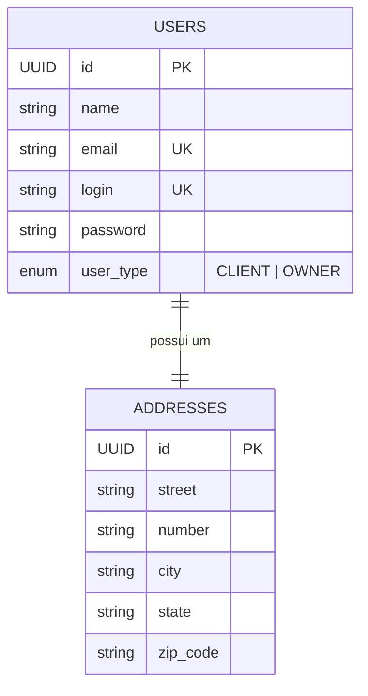

# 🍽️ FIAP Restaurant API (Phase 1)


> **Tech Challenge - Fase 1** | Pós-graduação em Arquitetura e Desenvolvimento Java - FIAP

## 📄 Sobre o Projeto

Este projeto consiste no desenvolvimento de um backend robusto para um sistema de gestão de restaurantes. O objetivo é unificar diversos estabelecimentos em uma única plataforma, permitindo gestão eficiente e interação centralizada para os clientes.

Nesta **Fase 1**, o foco foi o desenvolvimento do gerenciamento de usuários (Clientes e Donos de Restaurante), autenticação segura e preparação da infraestrutura utilizando containers.

### 🎯 Objetivos Técnicos
- Implementação de **Arquitetura Hexagonal** (Ports and Adapters).
- Segurança com **Spring Security** e **JWT**.
- Infraestrutura como código com **Docker** e **Docker Compose**.
- Alta cobertura de testes unitários.
- Código limpo seguindo princípios **SOLID**.

---

## 🏗️ Arquitetura (Hexagonal)

O projeto foi desenhado para garantir o desacoplamento estrito entre a lógica de negócio (Core) e as tecnologias externas (Frameworks, BD, UI).

### 🟢 Core (O Hexágono)
O coração da aplicação, independente de frameworks:
- **Domain:** Entidades puras (`User`, `Address`, `UserType`) e regras de negócio.
- **Ports:** Interfaces que definem os contratos.
  - *Inbound:* Como o mundo externo fala com o Core.
  - *Outbound:* Como o Core fala com o banco/infraestrutura.
- **Use Cases:** Implementação das regras de negócio e orquestração de fluxo (Ex: `CreateUserUseCase`).

### 🔴 Adaptadores (Infraestrutura)
Responsáveis por traduzir as comunicações:
- **Driving (Entrada):** Controllers REST (`UserController`).
- **Driven (Saída):** Implementações de persistência e segurança (`UserRepositoryAdapter`, `BCryptPasswordEncoderAdapter`).

---

## 🛠️ Tecnologias Utilizadas

- **Linguagem:** Java 25 (Preview Features)
- **Framework:** Spring Boot 4.0.0
- **Build Tool:** Maven (Wrapper)
- **Banco de Dados:** PostgreSQL 17.0
- **ORM:** Hibernate / Spring Data JPA
- **Segurança:** Spring Security + Java-JWT (Auth0) + BCrypt
- **Documentação:** SpringDoc OpenAPI (Swagger)
- **Mappers:** MapStruct
- **Testes:** JUnit 5 + Mockito

---

## 🗄️ Modelagem de Dados

O sistema utiliza um relacionamento **1:1** entre Usuários e Endereços.


---

## 🔌 Endpoints da API

A API segue o padrão REST e utiliza versionamento via URI (`/api/v1`).

### 📖 Documentação Swagger
A documentação interativa (OpenAPI) está disponível após a inicialização da aplicação:

> 👉 **[Acessar Swagger UI](http://localhost:8080/swagger-ui.html)**

| Método | Endpoint | Descrição |
| :--- | :--- | :--- |
| `POST` | `/api/v1/auth/login` | Autenticação (Retorna Bearer Token) |
| `POST` | `/api/v1/users` | Criação de novo usuário (Cliente/Dono) |
| `GET` | `/api/v1/users` | Listagem paginada de usuários |
| `GET` | `/api/v1/users/{id}` | Busca usuário por ID |
| `GET` | `/api/v1/users/search` | Busca usuário por nome |
| `PUT` | `/api/v1/users/{id}` | Atualiza dados cadastrais e endereço |
| `PATCH`| `/api/v1/users/{id}/password`| Atualização segura de senha |
| `DELETE`| `/api/v1/users/{id}` | Remoção de usuário |

---

## 🚀 Como Executar o Projeto

O ambiente é totalmente conteinerizado. Você precisará apenas do **Docker** e **Docker Compose**.

### Passos

1. **Clone o repositório:**
   ```bash
   git clone [https://github.com/eduschiliga/fiap-restaurant-api.git](https://github.com/eduschiliga/fiap-restaurant-api.git)
   cd fiap-restaurant-api
   ```

   ```bash
    cd fiap-restaurant-api
   ```

2. **Execute via Docker Compose: O comando abaixo irá compilar o projeto (dentro do container), criar a imagem Docker e subir o banco de dados e a API.**

   ```bash
    docker-compose up -d --build
   ```
   

2. Aguarde a inicialização: O serviço fiap-user-service aguardará o Healthcheck do PostgreSQL (pg_isready) antes de iniciar.

---

## Acessos

**API Base URL:** http://localhost:8080

**Swagger UI:** http://localhost:8080/swagger-ui.html

**Banco de Dados (Externo):** 

**host:** localhost:5432
**User:** root
**Pass:** root
**DB:** restaurantdb

---

## 🧪 Testes

Testes Automatizados (Unitários)
O projeto prioriza testes na camada de Use Cases e Domain, garantindo que a lógica de negócio funcione independente da infraestrutura.

**Cobertura:** Criação, Busca, Atualização, Deleção e Autenticação.

**Ferramentas:** JUnit 5 e Mockito.

Para rodar os testes localmente (caso tenha Java instalado):

```bash
    ./mvnw test
```

---

## Testes E2E (Postman)
Na pasta raiz do projeto, encontra-se a Collection do Postman configurada com scripts de pré-requisição para automação de tokens e IDs.

- Importe a collection no Postman.
- Use o Collection Runner.

# Execute o fluxo completo nesta ordem:
1. Create (Gera o usuário e as variáveis iniciais)
2. ERROR Duplicate E-mail
3. Auth (Gera o Token JWT)
4. Update
5. ERROR Max Length - Update
6. ERROR Max Length - Update
7. FindAll
8. Find By ID
9. Search Users
10. ERROR Required Field - Update Password
11. Update Password
12. Delete By ID
13. ERROR - Unauthorized


---

## ✅ Qualidade e Boas Práticas

**SOLID:** Aplicação rigorosa dos princípios, com ênfase em Single Responsibility e Dependency Inversion.

**Tratamento de Erros:** Global Exception Handler implementando a RFC 7807 (Problem Details) para padronização de erros HTTP.

**DTOs (Records):** Uso de Java Records para imutabilidade na transferência de dados.

**Segurança:** Senhas nunca trafegam ou são salvas em texto plano (BCrypt).

**Build Otimizado:** Dockerfile com Multi-stage build e conversão dos2unix para garantir execução em ambientes Windows/Linux.

---

## 👨‍💻 Autor
Eduardo Schiliga

Projeto desenvolvido para o curso de Pós-graduação em Arquitetura e Desenvolvimento Java - FIAP.
